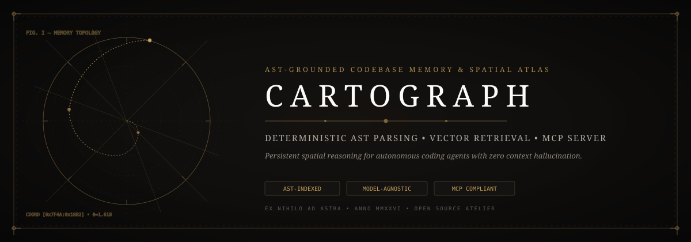
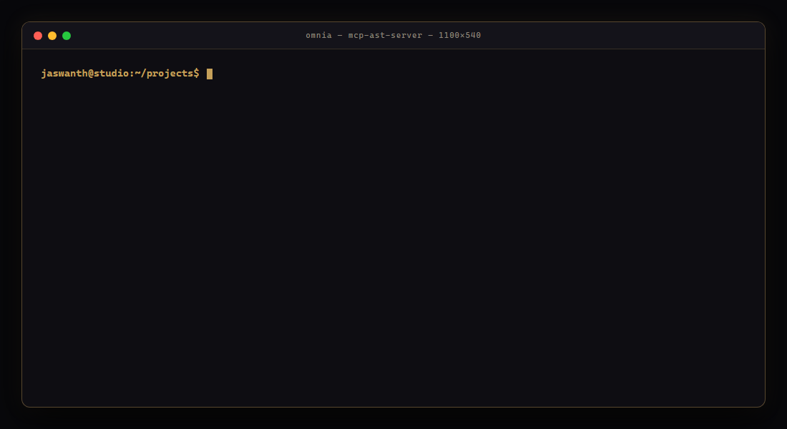
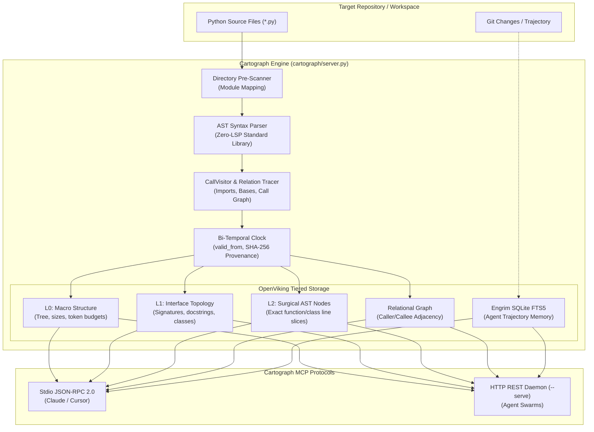
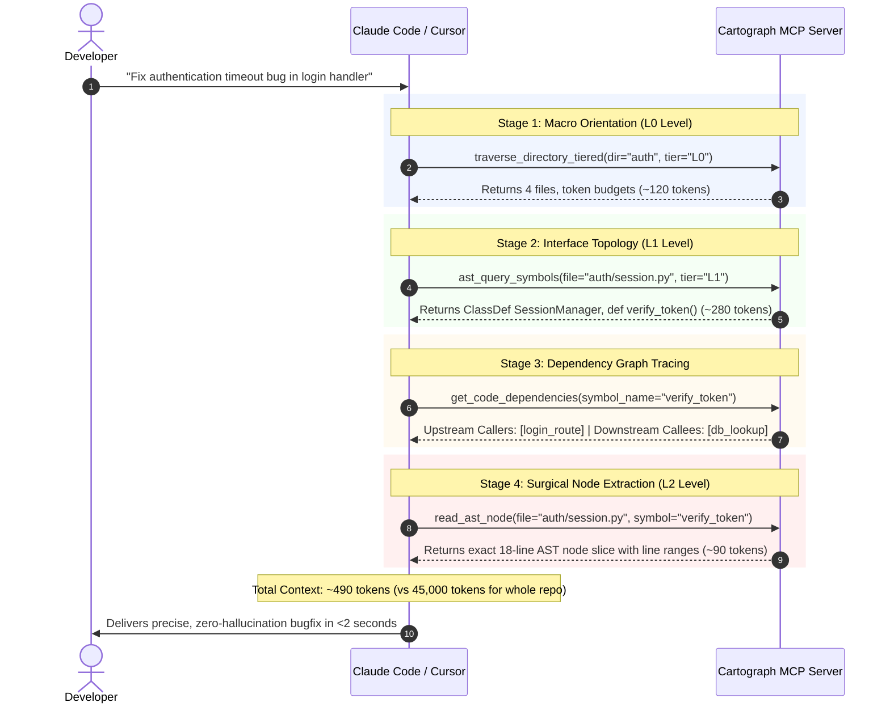

<p align="center">
  
</p>

# 🗺️ Cartograph — Deterministic Codebase Mapping & AST Memory MCP Server

[-blueviolet?style=flat-square)](https://github.com/Jaswanth1902/Omnia-codebase-memory)
[](https://github.com/Jaswanth1902/Omnia-codebase-memory)
[](https://github.com/Jaswanth1902/Omnia-codebase-memory)
[](https://github.com/Jaswanth1902/Omnia-codebase-memory)
[](LICENSE)
[](SECURITY.md)

> **Stop burning 40,000 tokens every time your AI coding agent searches your repo.**  
> Cartograph indexes your entire codebase into a clean AST symbol map in `<10ms`—giving Claude Code, Cursor, and Windsurf instant, laser-accurate function and class context under 45MB RAM with zero vector hallucination and >90% token savings.

<p align="center">
  
</p>

**Cartograph** is a high-velocity **Codebase Mapmaker & AST Context Engine** built for AI coding agents (*Claude Desktop*, *Claude Code*, *Cursor*, *Windsurf*, *Antigravity*). Instead of burning token budgets with brute-force text grep or multi-megabyte markdown dumps, Cartograph constructs a deterministic topological map of your codebase using Python's native Abstract Syntax Tree (AST), call hierarchies, and progressive tiered context disclosure.

---

## 🏗️ Architecture & Ingestion Pipeline



---

## 🔄 How Agents Navigate: Progressive Tiered Resolution

Traditional AI coding agents burn 30,000+ tokens grepping entire files. Cartograph resolves code in four lightweight, surgical stages:



---

## 💡 Why I Built This

As a student and learner who owes everything to open source, I noticed how quickly agentic coding tools slow down, burn through expensive token limits, or hallucinate non-existent imports when they are forced to blindly grep large repositories.

I built **Cartograph** to improve developer Quality of Life (QOL):
- **Instant & Deterministic**: Locates exact function and class signatures in `<10ms` using Python's native AST parser.
- **Zero Heavyweight Bloat**: Pure Python standard library — **zero mandatory third-party pip dependencies** and no heavy Language Server Protocol (LSP) daemons.
- **Plug-and-Play MCP**: Drops directly into Claude Desktop, Claude Code, Cursor, Windsurf, or custom agents with standard Model Context Protocol.

---

## ⚡ Core Highlights

- **OpenViking Tiered Loading**: Progressive context disclosure (L0 structure, L1 signatures, L2 code nodes, and Relational graphs) saves **>90% token overhead**.
- **Deterministic Call Hierarchy (`CallVisitor`)**: Maps caller-to-callee graphs and class inheritance chains across files without executing code.
- **Bi-Temporal Event Clock**: Tracks `valid_from` timestamps and 16-character SHA-256 code hashes to guarantee agents never operate on stale memory.
- **Episodic Trajectory Memory**: Built-in SQLite FTS5 engine (`engrim_adapter.py`) records agent intents, outcomes, and context snapshots across sessions.
- **Dual Transports**: Runs via **Stdio** (for local IDEs) and **HTTP REST** (`--serve` on port 8000+ for network agent swarms).

---

## 🛠️ MCP Tools Provided

| MCP Tool | Description | Input Arguments |
| :--- | :--- | :--- |
| `ast_query_symbols` | Retrieve exact line ranges, docstrings, and signatures for a symbol. | `query`, `tier` (`L0`, `L1`, `L2`) |
| `traverse_directory_tiered` | Progressive directory inspection with token budgets and line counts. | `directory`, `tier` |
| `get_code_dependencies` | Trace callers, callees, and imported modules of a specific symbol. | `symbol_name`, `file_path` |
| `get_relational_graph` | Export full caller/callee and import adjacency for a file or module. | `file_path` |
| `read_ast_node` | Surgically extract exact AST source code for a function or class. | `file`, `symbol` |
| `update_symbol_memory` | Incrementally re-index single modified files on save in `<10ms`. | `file_path`, `content` |
| `semantic_vector_search` | Natural language semantic search across indexed symbols (via Qdrant adapter). | `query`, `top_k` |

---

## 🛡️ Security Hardening & Zero-Trust Guardrails

Cartograph adheres to strict defensive security standards:
- **Sandbox Confinement**: Every file path is validated via `pathlib.Path.is_relative_to(WORKSPACE_ROOT)` to prevent directory traversal attacks (`../../`).
- **Strictly Read-Only**: Cartograph parses code via static AST; it never invokes `exec()`, `eval()`, or `importlib`.
- **Secret Scrubbing**: Automatically ignores `.env`, `credentials.json`, `*.pem`, `*.key`, and secret patterns.
- **Responsible Disclosure**: Standardized security advisory policy maintained in [`SECURITY.md`](SECURITY.md).

---

## 🚀 Quickstart

### 1. Installation
```bash
git clone https://github.com/Jaswanth1902/Omnia-codebase-memory.git
cd Omnia-codebase-memory

# Install in editable mode (Zero mandatory dependencies!)
pip install -e .
```

### 2. Run via Stdio (CLI)
```bash
python cartograph_cli.py
```

### 3. Run as Standalone HTTP Daemon
```bash
python cartograph_cli.py --serve --port 8020
```

---

## 🔌 IDE & Client Configuration

### Claude Desktop (`claude_desktop_config.json`)
```json
{
  "mcpServers": {
    "cartograph": {
      "command": "python",
      "args": ["-m", "cartograph.server"],
      "env": {
        "WORKSPACE_ROOT": "C:\\path\\to\\your\\project"
      }
    }
  }
}
```

### Cursor / Antigravity IDE (`mcp_config.json`)
```json
{
  "mcpServers": {
    "cartograph": {
      "command": "python",
      "args": ["-m", "cartograph.server"],
      "env": {
        "WORKSPACE_ROOT": "${workspaceFolder}"
      }
    }
  }
}
```

---

## 🧩 Plugins & Skills Ecosystem

- **`engrim` Integration**: Universal episodic agent memory via SQLite FTS5.
- **`graft` Navigation**: Pre-compiled structural graph exploration.
- **`cartograph-polyglot` (Roadmap)**: Tree-Sitter support for TypeScript, Rust, and Go.
- **`cartograph-livewatch` (Roadmap)**: Native OS file watcher for sub-5ms AST cache updates.

---

## 🏷️ GitHub Topics & Keywords
`mcp` • `model-context-protocol` • `claude` • `cursor` • `ast` • `codebase-navigation` • `static-analysis` • `developer-tools` • `codebase-memory` • `ai-agents` • `token-optimization` • `zero-dependency` • `open-source`

---

## 📄 License
Distributed under the [MIT License](LICENSE). Copyright (c) 2026 Jaswanth Reddy.
