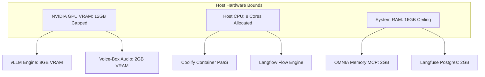

# OMNIA Architecture Essentials: Local Deployment & Infrastructure Bounds

## 1. Overview & System Scope

The OMNIA infrastructure layer establishes strict **local deployment boundaries** for orchestration, telemetry, and visual workflow routing. By hosting **Coolify**, **Langfuse**, and **Langflow** on localhost, the system provides production-grade orchestration while ensuring zero third-party telemetry leakage, minimal token latency, and predictable compute isolation.

---

## 2. Component Topology & Port Allocations

| Component | Role | Runtime / Engine | Port | Health Endpoint | Boundary Scope |
| :--- | :--- | :--- | :--- | :--- | :--- |
| **Coolify** | Local Container PaaS | Docker Daemon / Go / Node | `8000` / `3000` | `http://localhost:8000/api/health` | Local daemon only (`127.0.0.1`) |
| **Langfuse** | LLM Tracing & Observability | Next.js / Node / PostgreSQL | `3005` | `http://localhost:3005/api/public/health` | Internal loopback telemetry |
| **Langflow** | Visual Routing & Prompt Chaining | Python / FastAPI / React | `7860` | `http://localhost:7860/health` | Local workflow prototyping |
| **OMNIA Memory MCP** | AST & Vector Indexing | Python / FastAPI / Tree-Sitter | `8020` | `http://localhost:8020/health` | MCP Client socket |
| **Sensory MCP** | Crawl4AI, Maxun, Voice-Box | Python / FastAPI | `8025` | `http://localhost:8025/health` | MCP Client socket |

---

## 3. Deployment Bounds & Invariants

### 3.1 Coolify (Self-Hosted PaaS Engine)
- **Deployment Mode**: Local Docker socket mount (`/var/run/docker.sock` on Linux or Windows Docker Desktop pipe).
- **Resource Constraints**:
  - **Memory Cap**: Maximum $8.0\text{ GB}$ shared RAM across all spawned service containers.
  - **CPU Core Quota**: Maximum 4 vCPUs allocated to non-inference worker containers.
- **Service Isolation**: Each deployed service (Khoj, vLLM, Langfuse) executes within an isolated bridge network (`omnia-net`) preventing arbitrary cross-container communication.
- **Auto-Restart Policies**: Configured to `on-failure:3` to avoid infinite reboot loops when configuration syntax errors occur.

### 3.2 Langfuse Tracing & Observability
- **Trace Sampling Rate**: $100\%$ sampling for multi-agent reasoning loops; automated pruning of raw payloads older than 14 days.
- **Metrics Tracked**:
  - Exact token count (Prompt, Completion, Total) via tokenizer matching.
  - Latency per execution step (Time-to-First-Token and total generation duration).
  - Financial attribution: Exact cost tracking against pre-set token allowances ($250,000$ tokens per session).
  - Tool-call fidelity: Success vs. failure status of MCP tool invocations.
- **Security Boundary**: Public API keys disabled; only local loopback secrets stored in `99_Meta/Memory/` or `.env.local`.

### 3.3 Langflow Flow Routing & Prototyping
- **Role**: Rapid visual prototyping of conditional logic before compiling into production Python daemons (`antigrav.py` / `hybrid_router.py`).
- **Execution Limits**:
  - Maximum recursive loop depth: 5 iterations.
  - Request timeout threshold: $60\text{ seconds}$ per node execution.
- **Serialization Standard**: Flow definitions serialized to JSON and stored under `01_Projects/OMNIA_VAULT/flows/`.

---

## 4. Hardware Allocation & Safety Failsafes

### Safety Failsafes
1. **OOM Interceptor**: If total system memory exceeds $90\%$, `service_manager.py` terminates worker threads and sends a critical push notification via `Ntfy_Alerting`.
2. **Network Sandbox**: No service may bind to `0.0.0.0` unless explicitly authenticated behind a reverse proxy with TLS. All dev services bind to `127.0.0.1`.
3. **Data Loss Prevention**: Local database volumes mapped to persistent directories under `05_Services/<Service>/data/` and mirrored via `git_ship.py`.
