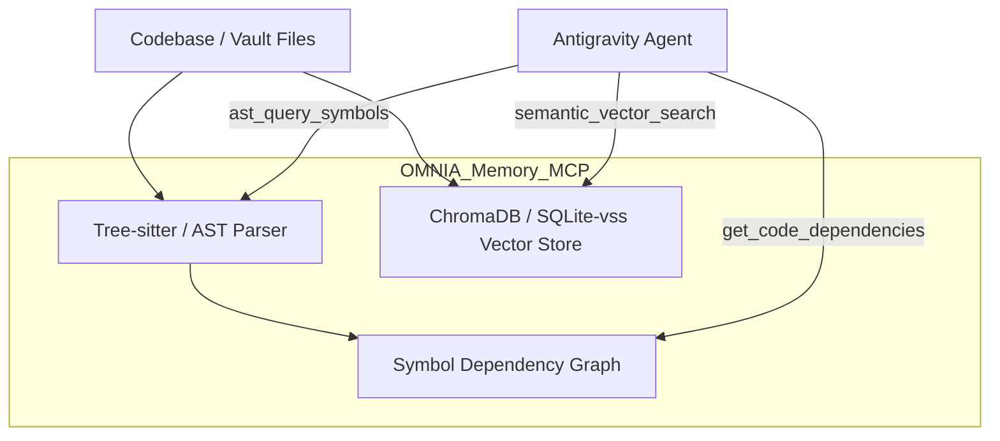
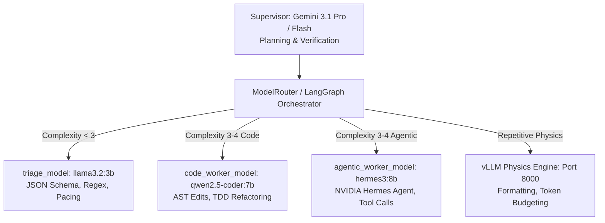

# OMNIA Architecture: Transitioning from Obsidian to Codebase-Memory-MCP

## 1. Architectural Evolution

The Antigravity system historically relied on **Obsidian** as its personal knowledge management (PKM) and markdown second brain. While Obsidian excelled at human prose organization and bidirectional wiki-linking, it presents significant friction when utilized as an active memory fabric for autonomous coding agents:

```
[Legacy Architecture]
User Intent ➔ Antigravity GUI ➔ Regex Grep / Wiki-Links ➔ Obsidian Markdown ➔ Context Window Bloat

[OMNIA Unified Architecture]
User Intent ➔ Antigravity Router ➔ OMNIA Codebase-Memory-MCP ➔ AST Symbol Graph + Vector Embeddings ➔ Precise Surgical Injection
```

---

## 2. Core Limitations of Obsidian for Agentic Memory

1. **Syntactic Blindness**: Markdown wiki-links `[[Target_Note]]` do not capture programming language semantics (classes, method signatures, call hierarchies, inheritance).
2. **Context Window Inefficiency**: Ingesting raw markdown documents forces the LLM to process thousands of tokens of formatting and unstructured text just to identify a single symbol definition.
3. **Stale Indexing**: File rename operations and structural refactoring frequently break unvalidated wiki-links, leaving dead references in the agent context.
4. **Lack of Programmatic Tooling**: Agents were restricted to basic file reading and grep, rather than querying semantic AST nodes directly.

---

## 3. The Codebase-Memory-MCP Solution

The **`Codebase-Memory-MCP`** (implemented in `05_Services/OMNIA_Memory_MCP/`) acts as the canonical memory substrate for the OMNIA Vault. It blends **Abstract Syntax Tree (AST) querying** with **local semantic vector retrieval**.

### 3.1 Dual-Engine Memory Fabric



### 3.2 Exposed MCP Tools & Primitives

1. **`ast_query_symbols`**:
   - **Signature**: `ast_query_symbols(query: str, symbol_type: str, file_pattern: str)`
   - **Capability**: Queries syntax trees for class definitions, function signatures, decorator bindings, and struct schemas without loading file bodies.
   - **Supported Languages**: Python (`ast`), TypeScript/JavaScript, Rust, Go.

2. **`semantic_vector_search`**:
   - **Signature**: `semantic_vector_search(query: str, top_k: int = 5, score_threshold: float = 0.75)`
   - **Capability**: Queries dense vector embeddings generated from code docstrings, interface declarations, and architectural notes.

3. **`get_code_dependencies`**:
   - **Signature**: `get_code_dependencies(symbol_name: str, depth: int = 2)`
   - **Capability**: Traverses the call graph and import tree to trace upstream callers and downstream dependencies.

4. **`update_symbol_memory`**:
   - **Signature**: `update_symbol_memory(file_path: str, mutation_type: str)`
   - **Capability**: Incrementally re-indexes modified AST nodes upon file save, ensuring zero-latency memory synchronization.

---

## 4. Phased Migration Strategy

| Phase | State | Description |
| :--- | :--- | :--- |
| **Phase 1: Dual-Write** | Deprecated | Legacy dual-write mode. Markdown notes and code ASTs synchronized concurrently; now superseded by MCP-first retrieval. |
| **Phase 2: MCP-First Retrieval** | Active | Agent context assembly routes 100% of symbol lookups and semantic searches through `OMNIA_Memory_MCP`. Obsidian relegated to human UI viewing. |
| **Phase 3: Autonomous Indexing** | Target | Daemonized file-watcher automatically updates AST embeddings on git commit; Obsidian operates purely as a read-only visual dashboard. |

---

## 5. Directory Mapping & Boundary Guarantees

- **Code Memory Server**: `05_Services/OMNIA_Memory_MCP/`
- **Memory Storage**: `05_Services/OMNIA_Memory_MCP/storage/` (local vector embeddings and AST cache).
- **Security Boundary**: Server binds exclusively to `127.0.0.1:8020`, prohibiting external socket access.

---

## 6. Local Worker Model Roster & Supervisor Mesh Integration

To eliminate external API latency and cloud quota consumption during iterative TDD loops, code execution is routed through the local three-model inference roster via the `LLM_Command_Center` reverse proxy (`http://127.0.0.1:11434`), forwarding to Ollama on port `11435`:



### 6.1 Hardware & Concurrency Boundaries
- **Shared Memory Limit**: Hard ceiling of 8.0 GB enforced across all local models.
- **Sequential Execution**: Strict async mutex lock (`model_execution_lock`) in `proxy.py` prevents overlapping model memory allocations.
- **Context Windows & Threads**: `llama3.2:3b` clamped to 4096 tokens (4 threads); `qwen2.5-coder:7b` & `hermes3:8b` clamped to 8192 tokens (8 threads).

